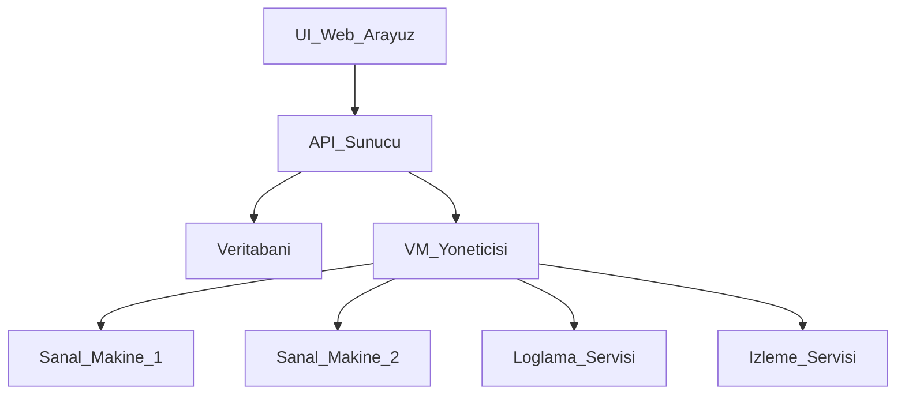
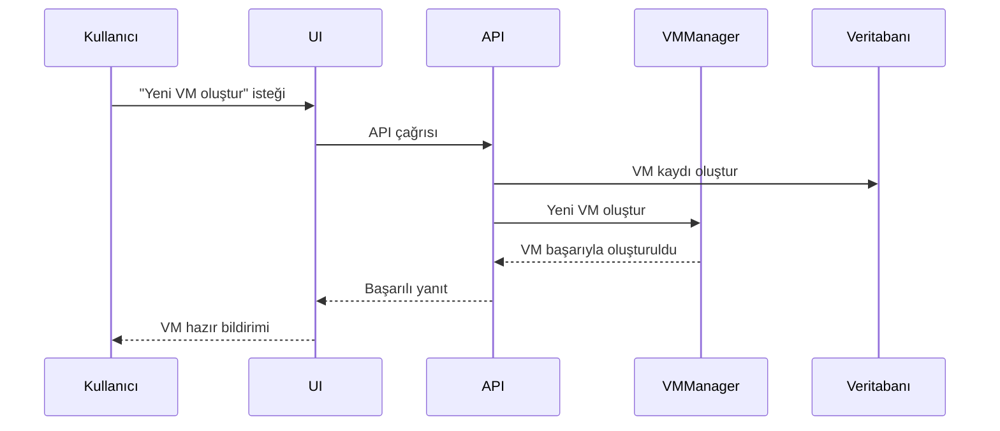
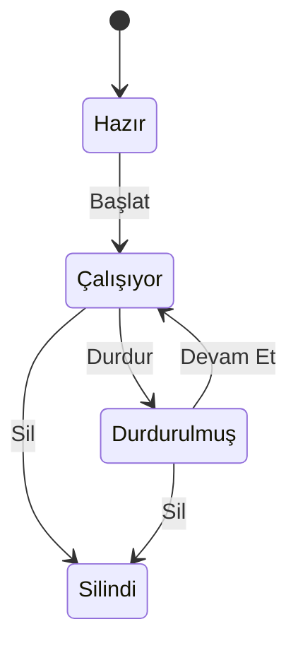
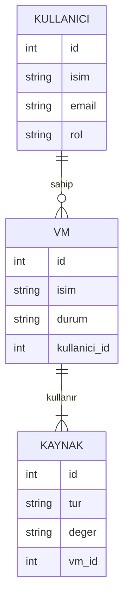
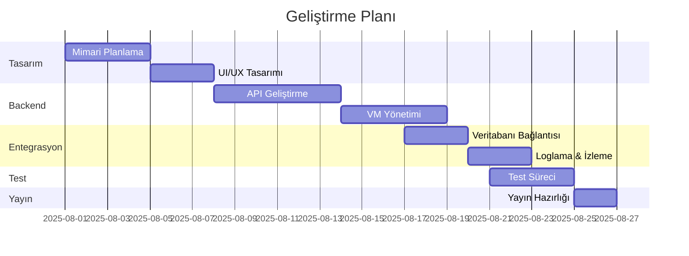
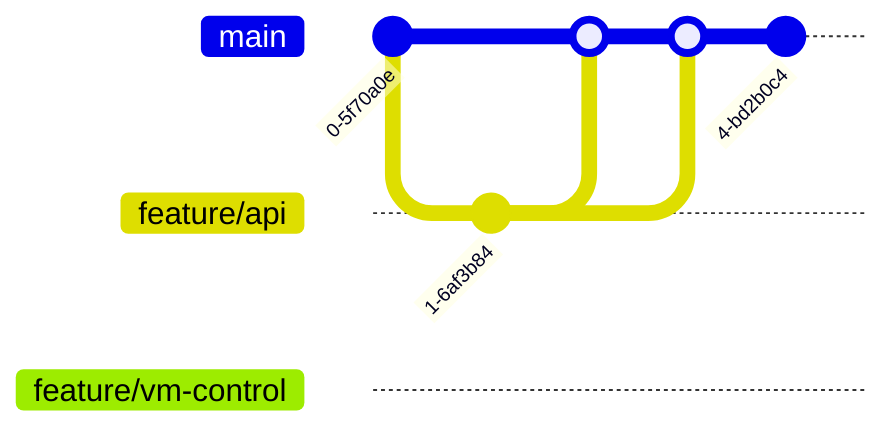

# 🧠 Proje: Sanal Makine Yönetim Sistemi

Aşağıda sistemin tüm yapısı, süreçleri ve veri ilişkileri Mermaid diyagramları ile anlatılmıştır.

---

## 🧱 1. Sistem Mimarisi

---

## 🔁 2. Kullanıcı VM Oluşturma Süreci

---

## 📊 3. Sanal Makine Durumları

---

## 🗃️ 4. Veritabanı Varlık İlişkileri (ER Diagram)

---

## 🛠️ 5. Geliştirme Takvimi (Gantt Chart)

---

## 🔁 6. Git Dal Yönetimi (Opsiyonel)

---

> Bu diyagramlar proje dokümantasyonu için idealdir. GitHub Markdown içinde doğrudan çalışır. Daha iyi önizleme için `https://mermaid.live` üzerinden test edebilirsin.
